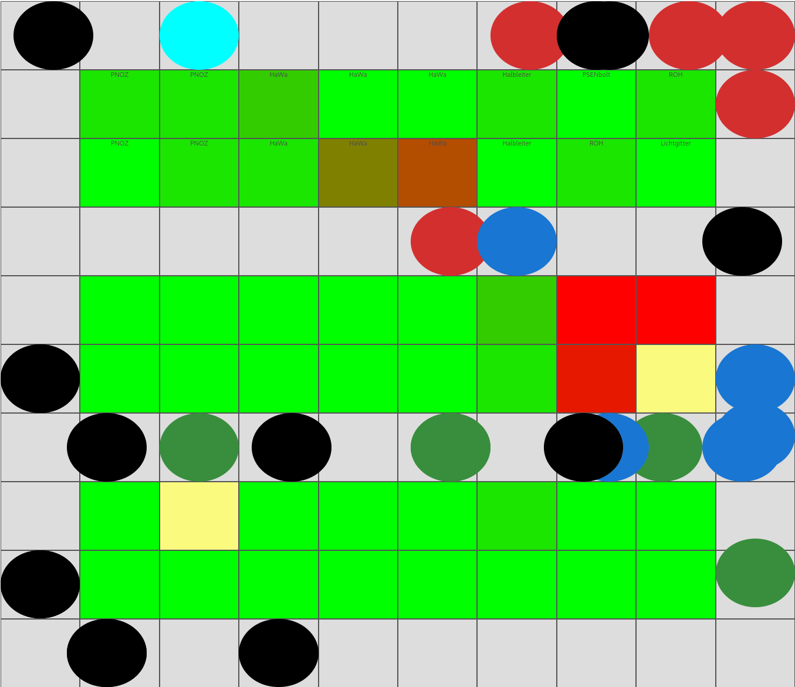

Die folgende Projektarbeit beschreibt die **Analyse**, **Konzeption** und **Simulation** eines dynamischen, zonenbasierten Lagerkonzepts unter Einsatz moderner Analysemethoden wie `Process Mining` und `Data Mining`.  
Ziel war die **Optimierung der Lagerlogistik** unter realitätsnahen Bedingungen und die Bewertung anhand definierter Kennzahlen (KPIs).  
<!--more-->

---

## 📦 Ausgangssituation

Die Analyse zeigte, dass das bestehende **Festplatzsystem** zwar Transparenz und einfache Orientierung bietet, jedoch **ungenügende Flexibilität** für hochfrequentierte Artikel („High Runner“) aufweist.  
Engpässe führten zu improvisierten Überlauflagerplätzen, die **Schattenbestände** und **erhöhten manuellen Aufwand** verursachten.

---

## 🎯 Projektziele

- Entwicklung einer **flexiblen Lagerstrategie** zur Verbesserung der Flächenauslastung  
- Einführung einer **Zonenstruktur** für unterschiedliche Artikel- und Prozessanforderungen  
- Nutzung **datenbasierter Simulationen** zur Entscheidungsunterstützung  
- Definition **messbarer KPIs** für eine spätere Erfolgskontrolle


---

## 🗂️ Lagerstrategien & Zonenkonzept

Die Lagerfläche wurde in **funktionale Zonen** unterteilt, z. B.:

| Zone                  | Zweck                                         | Relevante Strategien |
|-----------------------|-----------------------------------------------|----------------------|
| High-Runner-Zone      | Schneller Zugriff auf häufig genutzte Artikel | `ABC-Analyse`, `FIFO`, `Slotting` |
| Gefahrstoffzone       | Sichere Lagerung gesetzlich regulierter Güter | Lagerklassensteuerung, Zutrittskontrolle |
| Qualitätsprüfzone     | Wareneingangskontrolle                        | Quarantäne- & Prüflagerstrategie |
| VAS-Zone              | Value Added Services (Kitting, Etikettierung) | Arbeitsplatzorientierte Steuerung |
| Kommissionierzone     | Pick & Pack / Multi-Order-Picking             | Kommissionierstrategie |
| Versorgungszone       | Just-in-Time Materialbereitstellung           | Kanban, Replenishment |

> **Hinweis:** Die chaotische Lagerstrategie wurde gezielt **innerhalb bestimmter Zonen** eingesetzt, um Flexibilität und Auslastung zu optimieren.

---

## ⚙️ Technische Umsetzung der Simulation

```bash
Sprache:     Rust        # Performance & Sicherheit
Framework:   Tauri       # Schlanke Cross-Platform-UI
Methoden:    Process Mining, Data Mining
Ziel:        Vergleich Festplatzlogik vs. dynamische Zonenzuteilung

```
## 🖼️ Demo



